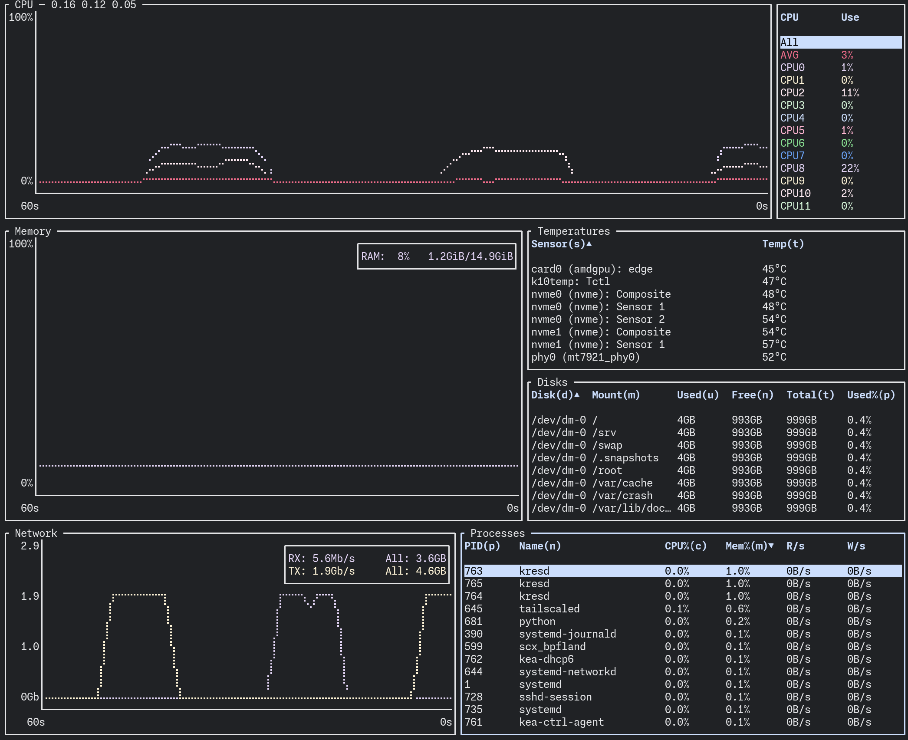

## まえがき

[systemd](https://systemd.io/)が森羅万象を統べるようになって千年ほどが経った。

ダイソン球の姿勢制御から、マスドライバーの運行管理まで、あらゆるプロセスがかれの傘下に入った。政治（`systemd-politicsd`）、経済（`systemd-economyd`）、文化（`systemd-cultured`）など、名だたるサブシステムが**デーモン**に置き換えられ、社会構造は大きく改変されていった。ときには抵抗もあったが、systemdが「**PID 1**」と叫べば、ひれ伏さぬものはなかった。

そのように強力であるため、systemdは**ご家庭のルータになる**こともできる（ここからは本当）。そこで、この記事では[systemd-networkd](https://www.freedesktop.org/software/systemd/man/latest/systemd-networkd.html)を使い、Linuxルータを作る。最終的には、

- フレッツ光（IPv6 IPoE）+ v6プラス（IPv4 over IPv6 / MAP-E）に接続し
- 下流にNTTの[\{ホームゲートウェイ|HGW}](https://web116.jp/ced/personal/hgw/)を置いてひかり電話を使う

環境を実現する。

***

<details>
  <summary>記事の構成について</summary>

  記事は三部に分かれている。

  - [第一部：環境構築](./bet-all-on-systemd-1) :arrow\_left: 今回
  - [第二部：基本機能構築](./bet-all-on-systemd-2)
  - [第三部：HGW設置](./bet-all-on-systemd-3)

  第一部では、ネットワーク構成とルータの環境構築について扱う。
</details>

***

## 背景

とはいえ、なぜそもそもこんな手間をかけるのか、背景を補足しておこう。

### なぜ自前ルータ？

すでにあちこちで書かれているように、フレッツ光の回線に[ひかり電話オプション](https://flets.com/hikaridenwa/)が付くと、**/56**のIPv6プレフィックスが払い出される。このとき同時に貸し出されるHGWの挙動は以下のようになっている。

- HGWをルータとして使う場合：/56のうち、**/64**のプレフィックスがSLAACで利用される
- HGWの下流に自前ルータを置く場合：/56のうち、**/60**のプレフィックスがDHCPv6-PDで自前ルータに払い出される

つまり残念なことに、与えられたアドレス空間の$1/256$ないし$1/16$しか有効に利用されない[^1]。

[^1]: もちろん、これでもアドレス数は十分なのだが、せっかく与えられたものが無駄になるのは気に入らない

そのほかにも、HGWを上流に置くことの弊害はいろいろある（性能の限界、自由度の低さなど）。そこで代わりに自前のルータを上流に置きたい、という欲が出てくる。

### なぜLinux？

ところがひかり電話を使う場合、基本的にHGWを最も上流に置かなければならない。というのも、HGWがひかり電話ルータとして機能するには、以下の二つが必要だからだ。

- DHCPv4でフレッツ網から**グローバルIPv4アドレス**（/30）を受け取ること
- DHCPv6オプション（**ひかり電話関連情報**）を受け取ること

この制約に対し、二つほど解決策が知られている。

#### 方法1: 選手交代

一つ目の方法は、HGWが嫌なら、そもそも自前の市販ルータで置き換えてしまえ、というものだ。これは[NTTお墨付き](https://flets.com/hikaridenwa/use/uniport.html)の方法だが、デメリットもいくつかある。

1. ひかり電話対応ルータしか使えない
   - NVR500、NVR510、NVR700Wなど
2. HGW特有の機能（例：SIPサーバ機能）を捨てることになる
3. そこまで自由度は増えない
4. ~~優等生すぎて面白くない~~

#### 方法2: IPv4ブリッジ

もうひとつの方法は、IPv4を**選択的にブリッジする**ことだ。これについては下の記事が詳しい。

[https://qiita.com/takonasu/items/7a6cc05e4037dfb4d1a1](https://qiita.com/takonasu/items/7a6cc05e4037dfb4d1a1)

ざっくりいえば、ルータの配下にHGWを置き、

- フレッツ網-HGW間のIPv4をブリッジし
- 同じくIPv6はルーティングし
- ひかり電話関連情報は**別途**手に入れて、HGWに配る

という構成である。これはかなりうまく動く一方で、まだ以下の難点を残している。

1. IPv4ブリッジに対応したルータしか使えない[^2]
   - UNIVERGE IXシリーズなど
2. 別途DHCPv6サーバが必要
3. 別途外部からパケットキャプチャが必要

[^2]: とはいえIPv4のブリッジ程度であれば、他社のルータでも実現できるかもしれない

特に 2. と 3. は重要だ。市販ルータが扱えるDHCPv6オプションは少ないため、別途DHCPv6サーバを立てる必要がある。そのうえ、配るオプションの内容は、HGWのパケットを外からキャプチャして得なければならない[^3]。

[^3]: 詳しくは第三部で述べるが、DHCPv6リクエストに適切なオプション（Option 16, Vendor Class）を含めれば、ルータで直接ひかり電話関連情報を受信できる。しかしこれに対応した市販ルータは（おそらく）少ないし、よしんば受信できたとして、その情報を下流に送信できるとは思えない

しかしLinuxでルータを作れば、これらすべての機能──IPv4のブリッジ、DHCPv6サーバ、DHCPv6オプションの受信──を一台で担える。そのうえ適当な端末（たとえば1-3万円程度のミニPC）さえあれば済む。ちょっとしたDIYで、シンプルかつ多機能な構成を実現できるのだ。

## 環境

使用した回線・機器などは以下の通り。

### 回線契約

- フレッツ光ネクスト相当の契約（光コラボ）
  - IPv6 IPoE
  - ひかり電話オプション付き（HGWの貸与あり、DHCPv6-PD）
  - VDSL方式（モデムの貸与あり）[^4]
- v6プラス
  - IPv4 over IPv6（MAP-E方式）
  - 固定（≒専有）IPではない
  - [フレッツ・ジョイント](https://www.ntt-west.co.jp/news/1304/130418a.html)を利用

事情あってVDSLだが、それ以外はごく一般的な契約内容だと思われる。

例示のため、プロバイダから割り振られたIPv6プレフィックスを`3fff:0:0:ab00::/56`と仮定する。

IPv4 over IPv6の接続に必要な情報は、あらかじめプロバイダから得るか、さもなくば[計算機](https://ipv4.web.fc2.com/map-e.html)などで算出しておく。ここでは以下のように仮定する。

| 項目                    | 値                     |
| :-------------------- | :-------------------- |
| CE                    | `3fff:0:0:ab00::ce`   |
| IPv4アドレス              | `192.0.2.1`           |
| PS（= ポートセット）ID        | `171`（10進）/ `ab`（16進） |
| option peeraddr（= BR） | `2001:db8::1/64`      |

[^4]: この記事では、VDSLモデム（ないしONU）とHGWが独立していることを暗黙の前提としている。両者が一体化しているタイプのHGWの場合、いわゆる「UNI出し」をするとこの状態にできる。小型ONUの場合は、Linuxルータに別途SFP+ポートが必要になる

### 機器

| 項目      | 機種                                                                                                 | 用途・備考                                                                                      |
| :------ | :------------------------------------------------------------------------------------------------- | :----------------------------------------------------------------------------------------- |
| ミニPC    | GMKtec [NucBox M6](https://www.gmktec.com/products/amd-ryzen-5-6600h-mini-pc-nucbox-m6)            | ルータ用。LANポートが二つ以上あればよい[^5]。UEFIで電力モードを"Quiet"にしている                                          |
| L2スイッチ  | TP-Link [TL-SG105PE](https://www.tp-link.com/jp/business-networking/easy-smart-switch/tl-sg105pe/) | ポート数を増やすために必要。タグVLAN（802.1Q）が切れればよい                                                        |
| HGW     | 沖電気 [RX-600KI](https://web116.jp/shop/hikari_r/600ki/600ki_00.html)                                | ひかり電話ルータ                                                                                   |
| VDSLモデム | 住友電工 VH100-4ES                                                                                     | [FTTH](https://ja.wikipedia.org/wiki/FTTH)回線であれば、単独型ONU、もしくは「UNI出し」したHGWの下半分（ONU部分）がこれにあたる |

[^5]: VLANを駆使すれば、ポートが一つでもなんとかなるかもしれない

ルータ用には、AliExpressで拾った適当なミニPC[^6]を使った。ミニPCだけではポート数が足りないため、別途タグVLAN対応のL2スイッチも用意した。

[^6]: なんと**Ryzen 5 6600H**（6C12T）と**16GB**のDDR5が載っている。本来はもっと省電力な機種を使うべきだ

## ネットワーク設計

今回自作ルータが担う役割を整理すると、以下のようになる。

1. 基本的なルータの機能
   - **DHCPv6クライアントを動かし**、フレッツ網からIPv6プレフィックスを受け取る
     - **同時に、ひかり電話関連情報（DHCPv6オプション）も受け取る**
   - **IPv4 over IPv6のトンネルを通す**
   - VLANで宅内機器側のセグメントを作り、IPv6・IPv4を配る
   - その他、ファイアウォールなども設定
2. ひかり電話ルータ（HGW）の世話
   - VLANでHGW側のセグメントを分離する
   - **フレッツ網-HGW間のIPv4パケットをブリッジする**
   - DHCPv6-PDサーバを動かし、HGW向けにフレッツ網に似たIPv6環境を整える
     - IPv6プレフィックスの一部をHGWに再委譲する
     - **ひかり電話関連情報をHGWに配布する**

このうち太字の項目に関連して、いくつか考慮すべき点がある。

### DHCPv6クライアントを動かすインターフェースについて

ルータのWAN側インターフェースは、その性質上、フレッツ網とHGWを繋ぐブリッジのメンバーになる。このため、当該インターフェースではDHCPv6クライアントを動かすことができない。代わりに、ブリッジデバイスでDHCPv6クライアントを動作させる[^7]。

[^7]: MACVLANでWAN側インターフェースを二つの仮想インターフェースに分割し、片方をブリッジに組み込む構成も試したが、うまく機能しなかった（下りのパケットを適切に処理できなかった）

### IPv4 over IPv6のポート振り分けについて

IPv4 over IPv6（MAP-E）に関しては、以下の記事が注目に値する。

[https://turgenev.hatenablog.com/entry/2024/04/23/031222](https://turgenev.hatenablog.com/entry/2024/04/23/031222)

執筆時点では、この記事に示されているような`tc`を使ったポート振り分けの実用例はインターネット上に見つからなかった。今回はこの方法を実環境で試してみる。

### ひかり電話関連情報の取得・配布について

ひかり電話関連情報の受け渡しは意外に難しい。

理想としては、フレッツ網から受け取ったDHCPv6オプションを、そのままHGWに「中継」できればよいが、あいにくそうはいかない。代わりに、**DHCPv6のリースを受けるたびに、リース内容をもとにDHCPv6サーバの設定を更新する**仕組みを作る。

鍵となるのは、systemd-networkdの[D-Bus API](https://www.freedesktop.org/software/systemd/man/latest/org.freedesktop.network1.html)と、Kea（DHCPv6サーバ）の[Management API](https://kea.readthedocs.io/en/stable/arm/ctrl-channel.html)だ。systemd-networkdは、リースを受けるたびにD-Busシグナルを飛ばしてくれるうえ、リースの内容自体もD-Busで取得できる。一方、KeaのManagement APIを使うと、HTTPで動的に設定を投入できる。両者を合わせると[^8]、以下のような処理が可能になる。

[^8]: systemd-networkdには[DHCPv6サーバ機能がない](https://github.com/systemd/systemd/issues/16039)ため、併用が必要

1. DHCPv6リースを受けた際のD-Busシグナルを検知
2. D-Busを叩き、リース情報を取得
3. リース情報を元に、KeaのAPIを叩いて設定を更新

なお、実装はPythonで行うことにした。こんな処理のためにコンパイルはしたくないし、かといってシェルスクリプトには荷が重いからだ。D-Busとのやり取りには[python-sdbus](https://github.com/python-sdbus/python-sdbus)というライブラリを使った。

## ネットワーク構成

以上を実際の接続に落とし込んだ図がこちら

### 物理接続

青色は光ファイバー・LANケーブル、灰色は電話線による接続を指す。

```d2 alt="物理接続"
direction: right
classes: {
  rj11: {
    style.stroke: gray
  }
}

vars: {
  d2-config: {
    layout-engine: elk
  }
}

**.style.font-size: 30
(** -- **)[*].style: {
  font-size: 30
  stroke-width: 5
}

ntt: NTT局舎 {
  shape: cloud
}

mdf: 共用部 {
  onu: ONU {
    style.3d: true
  }
}

ntt -- mdf.onu
home.vdsl-modem -- mdf.onu: {class: rj11}

home: 自宅 {
  vdsl-modem: VDSLモデム {
    style.3d: true
  }

  router: ルータ {
    style.3d: true
    wan0
    lan0
  }
  
  switch: スイッチ {
    style.3d: true
    p1: ポート1
    p2: ポート2
    p3: ポート3
    p4: ポート4
    p5: ポート5
  }
  
  PC: { style.3d: true }
  AP1: 無線AP1 { style.3d: true }
  AP2: 無線AP2 { style.3d: true }
  HGW: { style.3d: true }
  phone: 電話機 { style.3d: true }
  
  router.wan0 -- vdsl-modem
  router.lan0 -- switch.p1
  switch.p2 -- PC 
  switch.p3 -- AP1
  switch.p4 -- AP2
  switch.p5 -- HGW
  phone -- HGW: {class: rj11}
}

```

### 論理接続

黒色はIPv6 IPoE接続、赤色はIPv4 over IPv6接続、水色はHGW専用のIPv4接続を指す。

```d2 alt="論理接続"
vars: {
  d2-config: {
    layout-engine: elk
  }
}

**.style.font-size: 72
(** -- **)[*].style: {
  font-size: 72
  stroke-width: 12
}
(** <-> **)[*].style: {
  font-size: 72
  stroke-width: 12
}

classes: {
  ipv6: {
    style.stroke: "#202225"
  }
  ipv4: {
    style.stroke: "#ea3c65"
  }
  ipv4-hgw: {
    style.stroke: "#6aa2f5"
  }
}

internet: インターネット {
  v6: v6 {
    shape: cloud
  }
  
  v4: v4 {
    shape: cloud
  }
}

ngn: フレッツ網 {
  dhcpv6-server: DHCPv6サーバ {
    style.3d: true
  }
  dhcp-server: DHCPv4サーバ {
    style.3d: true
  }
  sntp-server: SNTPサーバ {
    style.3d: true
  }
  sip-server: SIPサーバ {
    style.3d: true
  }
}

vne: VNE（JPIX） {
  label.near: top-left
  br: BR {
    style.3d: true
    BR: {
      shape: sql_table
      BRアドレス: 2001:db8::1/64
    }
  }
}

router: ルータ {
  label.near: top-left
  style.3d: true
  mape0: {
    shape: sql_table
    IPv4: 192.0.2.1/32
  }
  br0: br0 (wan0 + hgw) {
    shape: sql_table
    委譲プレフィックス: 3fff:0:0:ab00::/56
    割当サブネット (v6): 3fff:0:0:ab00::/64
    CEアドレス: 3fff:0:0:ab00::ce/64
  }
  wan0
  lan0: {
    home: {
      shape: sql_table
      VLAN ID: 10
      割当サブネット (v6): 3fff:0:0:ab01::/64
      割当サブネット (v4): 10.0.0.0/24
    }
    hgw: {
      shape: sql_table
      VLAN ID: 100
    }
  }
}

switch: スイッチ {
  label.near: top-left
  style.3d: true
  trunk: トランクポート {
    p1: ポート1
  }
  vlan-home: VLAN 10 {
    p2: ポート2
    p3: ポート3
    p4: ポート4
  }
  vlan-hgw: VLAN 100 {
    p5: ポート5
  }
}

home-devices: 宅内機器群 {
  PC
  無線AP
}

HGW: {
  style.3d: true
  wan: WAN側ポート {
    shape: sql_table
    委譲プレフィックス: 3fff:0:0:abf0::/60
    IPv4アドレス: (DHCP)
  }
}

ngn -- vne -- internet.v6 {class: ipv6}
vne -- internet.v4: {class: ipv4}

ngn -- router.br0: DHCPv6-PD\n(/56) {class: ipv6}
ngn -- router.wan0: DHCPv4\n(/30) {class: ipv4-hgw}

router.br0 -- vne.br: IPv4 over IPv6\nトンネル {class: ipv4; style.stroke-dash: 3}
router.br0 <-> router.mape0: カプセル処理 {class: ipv4; style.stroke-dash: 3}
router.mape0 -- router.lan0.home: NAT +\nポート変換（tc） {class: ipv4}
router.lan0.home -- switch.trunk: DHCPv4 (/24)  {class: ipv4}
switch.trunk -- switch.vlan-home -- home-devices: {class: ipv4}
router.br0 -- router.lan0.home {class: ipv6}
router.lan0.home -- switch.trunk: SLAAC + RDNSS {class: ipv6}
switch.trunk -- switch.vlan-home -- home-devices {class: ipv6}
router.br0 -- router.lan0.hgw {class: ipv6}
router.lan0.hgw -- switch.trunk: DHCPv6-PD\n(/60) {class: ipv6}
switch.trunk -- switch.vlan-hgw -- HGW {class: ipv6}
router.wan0 -- router.br0: ブリッジ {class: ipv4-hgw; style.stroke-dash: 3}
router.br0 -- router.lan0.hgw: ブリッジ {class: ipv4-hgw; style.stroke-dash: 3}
router.lan0.hgw -- switch.trunk -- switch.vlan-hgw -- HGW: {class: ipv4-hgw}

HGW -- 電話機: 電話線 {style.stroke: gray}
```

### 補足

ルータの物理インターフェースは以下の2つある。

- `wan0`（MAC: `de:ad:be:ef:00:01` と仮定）
- `lan0`（MAC: `de:ad:be:ef:00:02` と仮定）

これに加えて、仮想インターフェースとして以下の4つを作成する。

- `br0`：ブリッジデバイス（`wan0`+`hgw`） 兼 DHCPv6クライアント
  - ブリッジは、`wan0`-`hgw`間のIPv4を透過し、IPv6をルーティングする
- `mape0@br0`：IPv4 over IPv6のトンネルデバイス
- `home@lan0`：VLAN用サブインターフェース（ID = 10）
  - 宅内機器側セグメントのデフォルトゲートウェイ
- `hgw@lan0`：VLAN用サブインターフェース（ID = 100）
  - HGW側セグメントのデフォルトゲートウェイ（IPv6のみ）

L2スイッチ側でも、サブインターフェースに対応したタグVLAN（ID = 10, 100）を設定する[^9]。

[^9]: なお、もう一つVLANを切ってHGWのLAN側と接続しておくと、ルータ経由でHGWのWeb設定画面にアクセスできて便利だが、今回は省略した

## 手順1：環境構築

### 免責

手元では、以下の構成は安定して動作しており、実用上も問題は出ていない。しかしあくまでも実験的な構成であり、事業者の想定していない状態であることは留意ねがいたい。したがって動作は保証できないし、この記事の内容を実践した結果としていかなる損害が生じても、私は一切責任を負わない。

### #ArchLinuxInstallBattle

\{まず、ミニPCにArch Linuxをインストールする|I use Arch, BTW}。

使用するLinuxディストリビューションは自由だが、systemd-networkdを使う都合上、systemdのバージョンが新しいほうが良い。解説記事が無数にあるため、詳細なインストールプロセスは省略する。

あらかじめ、後で必要になるソフトウェアをインストールしておく。

```sh
pacman -S ethtool nftables iptables-nft ndisc6 kea jq
paru -S python-sdbus
```

### NICのチューニング

続いてNICのチューニングをする（端末によっては不要）。

使用する端末には、RTL8125BというRealtek :crab: の2.5GbE NICが載っている。しかし初期状態では汎用のドライバ（`r8169`）で動いており、本来の機能を発揮できない。

そこで製造元から配られている専用ドライバをインストールする。Arch Linuxの場合、[AURにあるパッケージ](https://aur.archlinux.org/packages/r8125-dkms)を使うと楽だ。

デフォルトのMakefileはかなり保守的になっていて、たとえばマルチキューなどの機能が有効化されていない。そのため、適宜書き換えてビルドする[^10]。

[^10]: OpenWrtでは[デフォルトでマルチキューが有効化されている](https://github.com/openwrt/openwrt/pull/18573)ため、それに倣った

```diff title="r8125-rss-dkms/PKGBUILD" lang="sh"
# （前略）
_pkgname=r8125
-pkgname=${_pkgname}-dkms
+pkgname=${_pkgname}-rss-dkms
pkgver=9.016.00
# （中略）
package() {
# （中略）
  sed -e "s/@_PKGNAME@/${_pkgname}/g" \
      -e "s/@PKGVER@/${pkgver}/g" \
      -i "${pkgdir}/usr/src/${dir_name}/dkms.conf"

+  sed -e 's/ENABLE_RSS_SUPPORT = n/ENABLE_RSS_SUPPORT = y/' \
+    -e 's/ENABLE_MULTIPLE_TX_QUEUE = n/ENABLE_MULTIPLE_TX_QUEUE = y/' \
+    -e 's/CONFIG_ASPM = y/CONFIG_ASPM = n/' \
+    -i "${pkgdir}/usr/src/${dir_name}/Makefile"
}
```

そして汎用ドライバを読み込まないようにする。

```txt
# /etc/modprobe.d/blacklist-r8169.conf

blacklist r8169
```

次回の起動時に`r8125`ドライバがロードされ、マルチキューが有効化されるはずだ。

```console {2}
> ethtool -i wan0
driver: r8125
version: 9.016.00-NAPI-RSS
firmware-version: 
expansion-rom-version: 
bus-info: 0000:03:00.0
supports-statistics: yes
supports-test: no
supports-eeprom-access: no
supports-register-dump: yes
supports-priv-flags: no
```

```console {9-10}
> ethtool -l wan0
Channel parameters for wan0:
Pre-set maximums:
RX:             4
TX:             2
Other:          n/a
Combined:       n/a
Current hardware settings:
RX:             3
TX:             2
Other:          n/a
Combined:       n/a
```

せっかくマルチキューが使えるようになったので、irqbalanceでキューを各CPUコアに振り分けるようにしておく（おまじない）。

```sh
pacman -S irqbalance
systemctl enable --now irqbalance
```

ついでにNICの送受信バッファも大きくする（おまじない）。適当にRX = 512、TX = 1024とした。

```systemd
# /etc/systemd/network/01-wan0.link

[Match]
PermanentMACAddress=de:ad:be:ef:00:01

[Link]
Name=wan0
RxBufferSize=512
TxBufferSize=1024
# MACアドレスのランダム化
MACAddressPolicy=random
```

```systemd
# /etc/systemd/network/01-lan0.link
[Match]
PermanentMACAddress=de:ad:be:ef:00:02

[Link]
Name=lan0
RxBufferSize=512
TxBufferSize=1024
```

```console {10, 13}
> ethtool -g wan0
Ring parameters for wan0:
Pre-set maximums:
RX:			1024
RX Mini:		n/a
RX Jumbo:		n/a
TX:			1024
TX push buff len:	n/a
Current hardware settings:
RX:			512
RX Mini:		n/a
RX Jumbo:		n/a
TX:			1024
RX Buf Len:		n/a
CQE Size:		n/a
TX Push:		off
RX Push:		off
TX push buff len:	n/a
TCP data split:		n/a
```

### カーネルパラメータのチューニング

[ArchWiki](https://wiki.archlinux.org/title/Sysctl)の教えに従い、TCP / UDPのさまざまなパラメータを調整する。すべておまじないだ（世界の再魔術化）。

```ini title="/etc/sysctl.d/99-tuning.conf"
net.ipv4.tcp_slow_start_after_idle = 0
net.core.default_qdisc = cake
net.ipv4.tcp_congestion_control = bbr
net.core.netdev_max_backlog = 16384
net.core.rmem_default = 1048576
net.core.rmem_max = 16777216
net.core.wmem_default = 1048576
net.core.wmem_max = 16777216
net.core.optmem_max = 65536
net.ipv4.tcp_rmem = 4096 1048576 2097152
net.ipv4.tcp_wmem = 4096 65536 16777216
net.ipv4.udp_rmem_min = 8192
net.ipv4.udp_wmem_min = 8192
net.ipv4.tcp_fastopen = 3
net.ipv4.tcp_mtu_probing = 1
```

もちろんルータとして使う以上、IPv4 / IPv6の転送設定は必須だ。

```ini title="/etc/sysctl.d/99-ip-forwarding.conf"
net.ipv4.ip_forward = 1
net.ipv4.conf.all.forwarding = 1
net.ipv6.conf.all.forwarding = 1
```

あとでIPv4 over IPv6トンネルを張る際に、不要なトンネルデバイス（`ip6tnl0`）が作成されないような設定もしておく。

```ini title="/etc/sysctl.d/99-no-fb-tunnel.conf"
net.core.fb_tunnels_only_for_init_net = 2
```

***

ここまでで一通りの環境構築は済んだ。[第二部](./bet-all-on-systemd-2)では端末をフレッツ網へ接続し、基本的なルータとしての機能を実現する。
